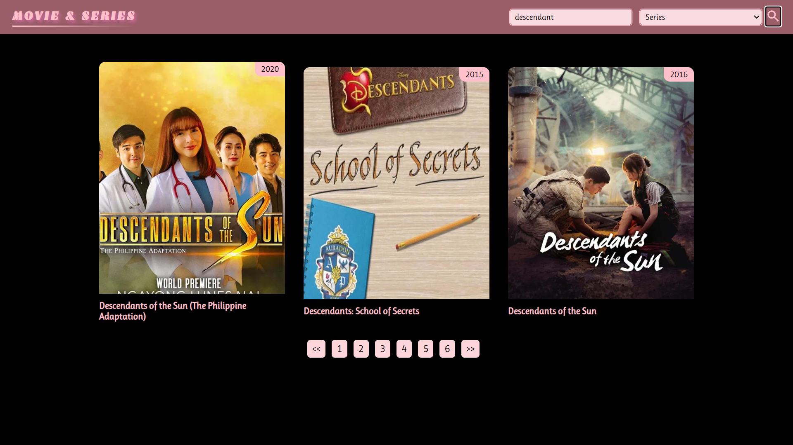
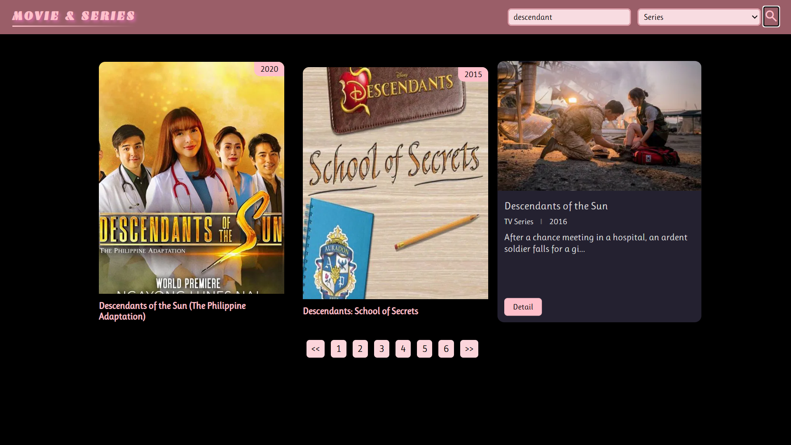
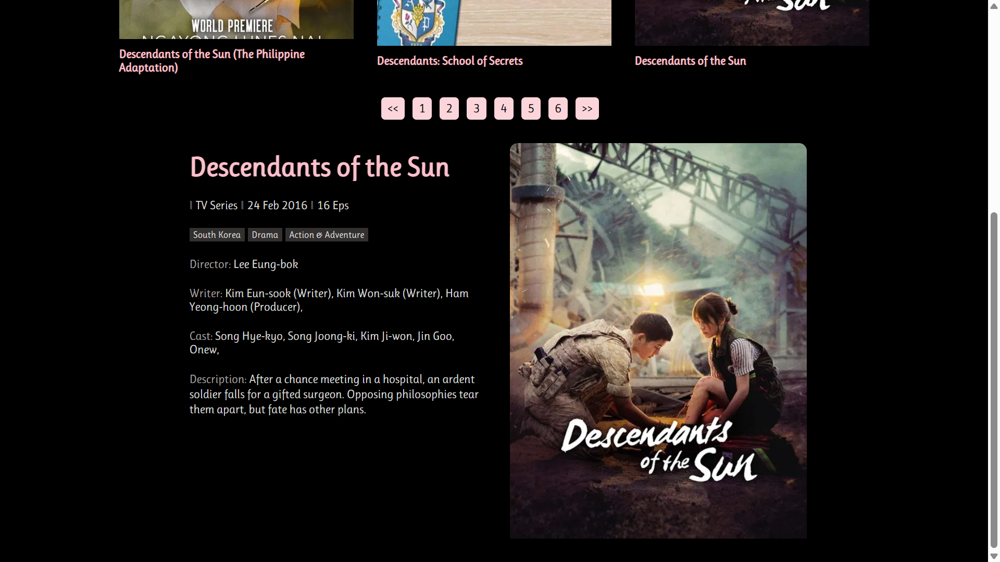

# **Film Search Application**

A web application that allows user to search for movies and TV series using the TMDB API and view results with detail information.

## Features

- search for movies or TV series by title

- clean display of search results with hover effect for quick info

- able to browse through multiple pages of search results using pagination

- view details for each result including:

  - Director, writers, and producers

  - Cast information

  - Release date

  - Country of origin

  - Genres

  - Number of episodes (for TV series)

  - Description
 
## Technologies used

- HTML5

- CSS3

- Vanilla Javascript

- TMDB API

## Website link

https://movie-searching-website-nu.vercel.app/

## Demo

Interface showing search results with pagination to browse through results

Interface showing hover effect on each result to show quick info

Interface displaying result details

Interface showing no results are found

